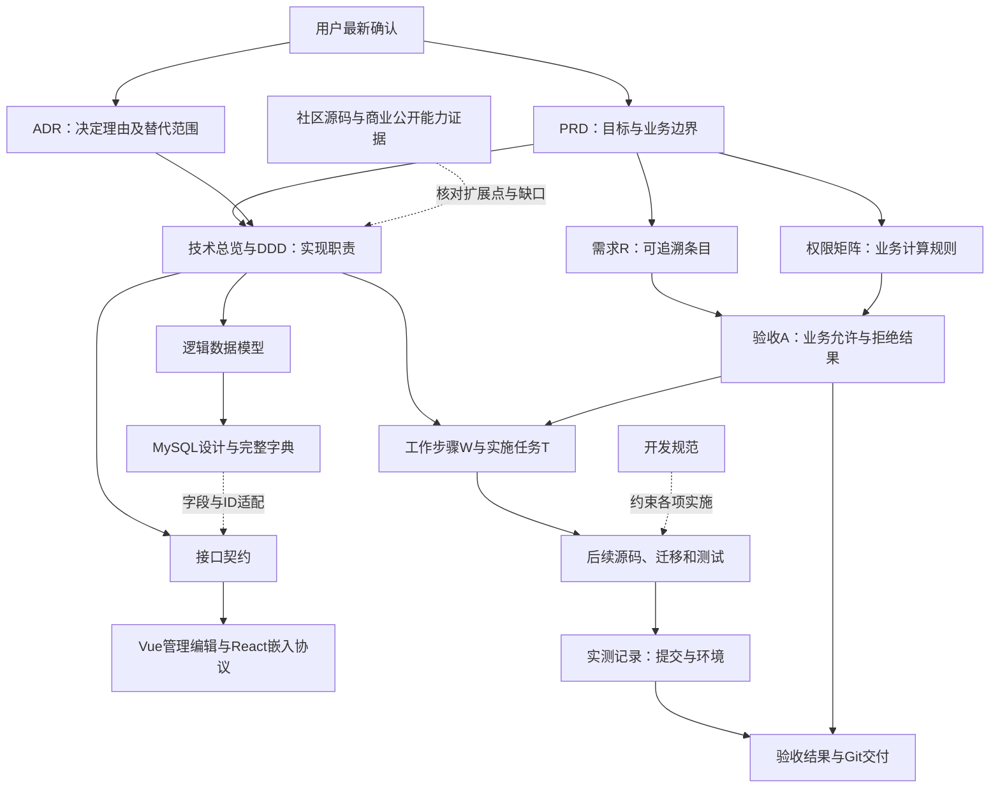

# 项目文档关系、阅读入口与同步规则

版本v1.2，2026-10-07。本文件是文档导航和维护约定；业务范围仍以[PRD v1.2](requirements/prd.md)为准，不新增产品需求。技术总览v0.4、MySQL字典v1.1是设计基线，未等于已实现。[需求到实施追溯表](planning/traceability.md)连接现有编号与设计/任务/验收。

每次开发或恢复开发前，从根/局部 [AGENTS.md](../AGENTS.md) 开始，依次读取[远程开发与整合验证规范](development/remote-workflow.md)、[开发规范](development/standards.md)、[构建手册](development/build-and-run.md)、[测试规范](development/testing.md)，再核对 W02、本轮工作包和设计。指定远程服务器为开发和验收主环境；模块内局部检查后，每个小功能都整合到完整源码做远程整体构建和功能验证，阶段结束另做完整回归。

## 1. 文档之间怎样连接

箭头表示依据、约束或追溯，不表示相关功能已经完成。源码事实反映“现在有什么”，PRD表达“要达到什么”；二者不一致时登记实现缺口，不用既有实现覆盖新需求。商业公开功能仅作能力参照，不能成为自研实现/测试证据。

## 2. 每类问题由哪份文档负责

| 要查的问题 | 主文档 | 其他文档的作用 |
| --- | --- | --- |
| 产品要做什么、首期与后续边界 | [PRD](requirements/prd.md) | phase1分配R编号，ADR说明决定原因，技术文件落实实现 |
| 每项需求来源和编号 | [需求说明](requirements/phase1.md) | 不重复维护另一份R清单；其他文件引用原编号 |
| 角色与学校如何配对、允许/禁止如何合并 | [权限矩阵](requirements/permission-matrix.md) | authorization-query实现该规则，不能从旧MANAGE编码推导新权限 |
| 何种业务结果算通过 | [验收场景](requirements/acceptance.md) | POC/技术验证细化手段，不能替代A用例或缩减P0范围 |
| 为什么作出选择、旧决定如何被替代 | [ADR目录](adr/README.md)及对应ADR | 新决定按接受范围替代旧决定，保留旧理由，不按文件编号机械决定全部优先级 |
| 自研模块职责、领域约束和事务 | [技术总览](technical/README.md)、[DDD上下文](technical/ddd-contexts.md)、[聚合](technical/ddd-aggregates.md)、[一致性](technical/ddd-consistency.md) | architecture负责概览；具体模型/事务规则只在技术分册主文档维护 |
| 数据逻辑模型、字段与数据库约束 | [数据模型](technical/data-model.md)、[MySQL设计](technical/mysql8-design.md)、[完整字典](technical/mysql8-table-dictionary.md) | data-model讲语义，MySQL设计讲持久化/事务/运维，字典是精确列名/类型/默认/索引/FK主出处 |
| 请求、响应、ID/类型适配与错误行为 | [接口契约](technical/api-contracts.md)、[字段约束](technical/api-field-constraints.md) | 前者维护路由/HTTP行为，后者维护新DTO逐字段和默认上限；API学校组织ID、平台用户ID经后端映射，不自动换成数据库列语义 |
| 查询、缓存、任务和交付的权限判断 | [权限与查询](technical/authorization-query.md) | 使用矩阵、类型化策略及一致性文档；数据库、接口、编辑不能各自发明算法 |
| 宿主如何免登录、消息/Origin/会话如何绑定 | [嵌入协议](technical/embedding.md) | 接口文档管HTTP边界，字典管持久化，前端文档管页面与编辑行为 |
| 是否每家公司要定制开发 | [通用产品与接入配置](technical/product-configuration.md) | 统一代码/页面/协议；公司字段、角色、指标和网址是配置，特殊协议仅接入边界适配 |
| 权限页面、无权占位、学校副本和安全保存 | [前端与编辑](technical/frontend-editor.md) | 引用矩阵/接口/一致性，不在浏览器维护最终授权事实 |
| 开发顺序与前置输入 | [工作步骤](planning/phase1-roadmap.md) | 实施文档定义T/C/P，W01登记评审/输入，W02记录环境/Git事实 |
| 如何开始编码并到远程服务器测试 | [实施开发计划](planning/development-plan.md) | 细化现有W/T的编码阶段、完成标准、工程细节、skills和Git/远程测试循环，不重定义依赖或业务规则 |
| 每次开发前读什么、在哪里开发、何时整体编译 | [远程开发与整合验证规范](development/remote-workflow.md) | 开发位置、逐功能整合频率和执行记录的主出处；W02记录实测环境，构建手册维护命令，测试规范维护用例层次 |
| POC编号、核心补丁候选和验证方式 | [实施验证](technical/implementation-validation.md) | P01–P06只在此定义；V01–V10在一致性文档定义；实际补丁另登upstream |
| 当前输入/决定到了哪一步 | [W01评审](planning/w01-review.md) | W02给环境事实；概览只引用状态，不复制多个独立状态清单 |
| 需要用户补什么、什么时候要 | [实施输入](planning/implementation-inputs.md) | 已确认内容不重复问；区分工程任务、专用测试区/数据库和账号边界、后续真实联调材料 |
| 测试服务器和项目Git目标 | [W02环境与交付](planning/w02-environment.md) | 区分已登录/工具可用、双集团数据库/账号已验证、Git配置目标、Git推送成功四种事实 |
| 如何写代码、迁移、测试、配置和补丁登记 | [开发规范](development/standards.md)及development分册 | 遵循根[AGENTS.md](../AGENTS.md)；规范约束实现，不自行扩张首期产品范围 |
| 某个结果是否真的验证过 | 有提交/时间/环境的执行记录；当前[Phase0记录](phase0/verification.md)、W02 | 旧Phase0构建/登录不能证明首期权限实现；计划或字典检查不能作为业务测试通过 |

同一主题的主文档负责详细规则，其他文件只维护摘要和链接。发现同级已确认文档冲突时，记录冲突和修正两侧；在解决前不实施依赖该冲突的行为，独立任务继续。

## 3. 当前依据与状态必须分开

2026-10-08校验修复及架构整改主入口：[ADR-015](adr/015-schema-validation-and-startup.md)、[W03整改记录](development/schema-validation-review.md)。本轮不改变PRD业务；基础迁移默认值/索引/CHECK字面量比较已修复，局部测试46项通过，整合与Git结果以整改记录最终证据为准。版本/JPA/请求就绪优化是后续设计门槛，未描述为已实现。下表及后文保留注明日期的历史快照。

| 对象 | 当前有效范围 | 状态 |
| --- | --- | --- |
| PRD v1.2、R01–R13、权限矩阵 | 多集团/学校/主体/动作、模板副本及嵌入编辑业务 | 用户已确认；功能待实施 |
| ADR-009/010/011 | 首期业务、保留Vue+React iframe、集团数据库级隔离 | 已确认范围；009共享跨集团表前提由011替代 |
| ADR-013用户选型部分 | MySQL8、单应用节点、沿源码后端；集团分库以014澄清为准 | 用户已确认；不等于数据库/账号运行隔离验收通过 |
| ADR-012及013技术细化 | 独立业务数据库/账号、DDD、subject/grant、管理能力独立表、侧表所有权、MySQL票据状态 | 设计采用/待对应评审与POC；W02合成库及只读账号边界已检查，真实身份/资源/查询隔离仍待，不整体宣称已验证 |
| ADR-014最新澄清 | 集团分数据库可同实例；通用配置产品；现有测试库/目录/服务保留 | 用户已确认，替代011部署强解读及013强制独立实例/卷；W02合成分库边界已检查，完整业务运行验证仍待 |
| 技术总览v0.4/MySQL字典v1.1 | 逻辑、字段与接口/协议实现依据 | 草案/技术设计；迁移/DTO/接口未创建 |
| W02执行 | 专用检出、企业门禁、SDK上下文基础与获授权隔离实例 | 2026-10-07累计22项单测、14项数据库检查、4项社区API兼容及完整包两项拒绝通过，各小功能均整体构建；见[安全基线](planning/w02-security-baseline.md)；真实HTTP身份与业务权限、P01整体仍待完成 |
| 宿主源码/真实业务表 | 暂未提供，先合成模型及模拟宿主 | 真实对接未完成，模拟POC不得写成真实宿主联调通过 |
| Git交付 | 完成开发与对应验证后推送项目origin | W02已推送codex/phase1-security-baseline，最终3650ce1（第一项dc8f2aa）；原有文档输入及修改未夹带，待用户或团队独立评审，未合入开发分支或改动现有服务；见安全基线第8节 |

“设计采用”表示已在文档选定工程方案，仍要完成其评审/POC门槛。源代码、迁移、接口和测试实施后分别记录，不能只把文档状态一并改成“完成”。业务变更提高PRD版本；技术/导航/编号纠错只提高相关文档版本或登记修正，不能伪造业务变更。

## 4. 历史和冲突处理规则

1. 用户最新确认优先，但必须同步PRD/对应需求及新ADR的具体接受范围。未确认的技术提案不能取代业务规则。
2. 已接受ADR只替代明确范围；009→011更改跨集团共表前提，010选择iframe，013部分替代007，012细化DDD；014澄清集团分库可同实例并替代011部署强解读/013独立实例卷提案，确定通用产品和现有环境保护。
3. 同层技术文档以第2节主出处为准：精确数据库字段看字典，HTTP行为看api-contracts，浏览器协议看embedding，业务授权公式看矩阵，执行/交付一致性看ddd-consistency。
4. 不拿较晚时间的执行快照改写PRD，也不拿较早Phase0状态否定新的W02实测。跨环境事实标时间、源码提交/版本与核对范围，未覆盖不推断。
5. “本次只写文档”“本次未推送”等句子是对应交付阶段事实，不是永久禁止后续编码/Git交付。需求设计阶段说明均MD；实施阶段必要源码、迁移、测试和配置按仓库约定创建，交付说明仍用MD。
6. 不在architecture另设一套接口、字段或权限规则；概览若过时改摘要/链接，保留明确标注的历史ADR/实测记录。

## 5. 编号归属

| 编号 | 主出处 | 含义与关系 |
| --- | --- | --- |
| R01–R13 | [phase1](requirements/phase1.md) | 需求；R12是阶段交付/最小改动约束，不凭空增加业务用例 |
| ADR-001–014 | [ADR目录](adr/README.md) | 决策及接受/替代范围；未接受建议不能扩产品范围 |
| D01–D08 | [技术总览](technical/README.md) | 技术选择定义；W01登记采用/验证状态，不改其编号含义 |
| M0–M4 | [工作步骤](planning/phase1-roadmap.md) | 阶段及门槛；代码/测试未执行时不记阶段通过 |
| W01–W10 | [工作步骤](planning/phase1-roadmap.md) | 工作包及先后依赖；后续任务以W作为稳定引用 |
| T00–T10、C01–C11 | [实施验证](technical/implementation-validation.md) | 实施任务/核心适配候选；C候选不是已修改清单 |
| P01–P06 | [实施验证](technical/implementation-validation.md) | 最小闭环POC；P04混合编辑，P05 React嵌入，不得互换 |
| A01–A33 | [acceptance](requirements/acceptance.md) | 业务验收；必须有实际结果/提交/环境才能记通过 |
| V01–V10 | [一致性](technical/ddd-consistency.md) | A的技术细化；通过V不自动覆盖所有A |
| B01–B06、S01–S08 | [社区/商业对照](technical/community-commercial-map.md) | 商业公开能力/社区静态证据；源编号新增以实际主表为准 |

编号含义不得在其他文档重定义；引用时使用主出处链接。[追溯表](planning/traceability.md)提供R→设计/任务/A、W→T/P及V→A关系，表中“关联”不是“已完成”。

## 6. 开发中怎样同步文档

| 本次变更类型 | 先更新的主出处 | 必须检查的下游 |
| --- | --- | --- |
| 新需求/授权语义/首期边界变化 | PRD、phase1、矩阵或验收；新增明确替代的ADR | 追溯表、技术设计/字段/接口、页面、工作包与实际测试 |
| DDD职责或事务/安全一致性变化 | 对应DDD分册，重大选择新增ADR/登记D状态 | 模块概览、数据模型、字典、接口/查询/编辑和V场景 |
| 字段/表/索引/状态变化 | MySQL字典、MySQL设计及新增迁移设计 | 逻辑模型、DTO映射/接口、JPA更新行为、迁移规范及实际空库/升级测试 |
| 接口/错误码/ID/认证头变化 | api-contracts，必要SDK与前端类型 | embedding/前端/查询适配、配置、公开契约兼容和负向测试 |
| 看板编辑/嵌入交互变化 | frontend-editor或embedding | API白名单、状态存储、撤销/发布/重开、A/V以及宿主适配 |
| 开发环境/依赖/运行事实变化 | W02或对应新执行记录，写时间/提交/范围 | W01摘要与任务门槛、配置/build-and-run适用性；不重写旧实测结果 |
| 核心源码/入口调整 | development/upstream登记实际补丁与调用方 | 对应设计/C候选、迁移/API/前端兼容、已运行回归及未覆盖入口 |
| 测试/Git交付 | 有提交与环境的任务执行记录、覆盖表 | 追溯表结果引用、W01/W02摘要与acceptance状态；源码提交与部署分开记录 |

每个开发任务必须能串起：W/T编号→R与现行ADR→主设计/字段/接口→实际改动→A/V/P与实测→提交/Git结果。一个任务可涉及多个R或共享基础设施；不能靠复制文档段落制造追溯。

任务记录的最小字段：需求/工作包/决策编号、设计与源码入口、修改/迁移范围、允许和拒绝预期、测试条件/报告、提交与环境、失败及未覆盖、同步过的文档、Git交付状态。真实结果不存在时填“待实施”，不填预测通过。

## 7. 阅读顺序与文档目录

产品/使用方：PRD→矩阵→验收→现行ADR→W01。后端：本入口→追溯表→DDD→数据模型/MySQL字典→API/查询/一致性→工作步骤→开发规范。前端/宿主：PRD/矩阵→API→embedding/frontend-editor→对应W与A。测试/运维：验收/一致性V→实施P→MySQL/迁移/配置→W02及实际执行记录。

| 目录/入口 | 文档职责与链接 |
| --- | --- |
| 根入口 | [PHASE0](../PHASE0.md)：源码基线与演进入口；[AGENTS](../AGENTS.md)：工作区约束 |
| requirements | [prd](requirements/prd.md)、[phase1](requirements/phase1.md)、[permission-matrix](requirements/permission-matrix.md)、[acceptance](requirements/acceptance.md) |
| adr | [索引与001–014](adr/README.md)：逐条查看原理由、状态和替代范围，不复制多份详细决定 |
| architecture | [overview](architecture/overview.md)、[module-boundaries](architecture/module-boundaries.md)、[tenant](architecture/tenant.md)、[permission](architecture/permission.md)、[embedding](architecture/embedding.md)、[deployment](architecture/deployment.md)、[threat-model](architecture/threat-model.md)：系统概览与风险边界，详情回技术主文档 |
| technical：证据和DDD | [README](technical/README.md)、[community-commercial-map](technical/community-commercial-map.md)、[ddd-contexts](technical/ddd-contexts.md)、[ddd-aggregates](technical/ddd-aggregates.md)、[ddd-consistency](technical/ddd-consistency.md) |
| technical：数据和契约 | [data-model](technical/data-model.md)、[mysql8-design](technical/mysql8-design.md)、[mysql8-table-dictionary](technical/mysql8-table-dictionary.md)、[mysql8-business-reference](technical/mysql8-business-reference.md)、[authorization-query](technical/authorization-query.md)、[api-contracts](technical/api-contracts.md)、[api-field-constraints](technical/api-field-constraints.md)；业务reference不是实际业务表 |
| technical：交互和实施 | [embedding](technical/embedding.md)、[frontend-editor](technical/frontend-editor.md)、[implementation-validation](technical/implementation-validation.md)、[product-configuration](technical/product-configuration.md) |
| planning | [phase1-roadmap](planning/phase1-roadmap.md)、[development-plan](planning/development-plan.md)、[w01-review](planning/w01-review.md)、[w02-environment](planning/w02-environment.md)、[traceability](planning/traceability.md)、[implementation-inputs](planning/implementation-inputs.md)：工作包、编码与远程测试、输入/环境与执行关系 |
| development | [remote-workflow](development/remote-workflow.md)、[standards](development/standards.md)、[api](development/api.md)、[database](development/database.md)、[configuration](development/configuration.md)、[migration](development/migration.md)、[testing](development/testing.md)、[observability](development/observability.md)、[upstream](development/upstream.md)、[build-and-run](development/build-and-run.md)：实施规范，首期范围仍由PRD约束 |
| phase0 | [source-audit](phase0/source-audit.md)、[verification](phase0/verification.md)、[review-checklist](phase0/review-checklist.md)：历史基线/实测与评审项，按日期读取，不能证明首期业务已完成 |

## 8. 本次关系核对与修正

| 项目 | 修正内容 | 业务范围影响 |
| --- | --- | --- |
| POC编号 | W01的D04嵌入→P05，D05编辑→P04，与实施主表及W06/W07一致 | 无，保留原编号含义 |
| Ticket失败/幂等 | 消费前复查，同库消费/唯一会话一起提交；已提交消费不可复活，内部失败回滚不返回凭据，客户端新握手换票；不保存凭据原值用于幂等重返 | 无，落实一次消费与当前授权 |
| 选型/当前进度 | 单节点为用户确认；独立业务数据库/账号为技术细化，具体边界待评审和实证；已有SSH预检不等于功能/双集团验证 | 无，不改变已确认隔离边界 |
| 文档层次 | 新增主出处和同步规则、统一追溯表、更新入口回链 | 无，PRD仍v1.1，A/V编号不变 |

只执行Markdown修改/静态核对；源码、数据库、服务器、构建和Git发布未在本次执行。后续开发按本文件继续维护这些关系，不能只在首次交付时检查一次。

上一轮关系梳理的2026-10-07实际文档核对结果：project-docs及PHASE0共57份MD、555处本地链接均有效，均可从本入口到达；152张Markdown表列数、代码围栏及4个JSON示例解析检查无错误。追溯表的13项R、33项A、10项V与主表对应一致，10个W与T映射一致，编辑P04/嵌入P05引用一致。原有`node tools/phase0-check.mjs`通过其32个必需文件和22份基线MD检查；该脚本覆盖基线，新增文档由本次额外静态检查覆盖。`git diff --check`通过，原有两处Vue、开发配置、build-and-run和历史verification文件的SHA256保持不变。以上仅是本次文档质量结果，不是A/V/P业务验证通过。

## 9. 字段方案与实施输入补充

2026-10-07新增接口字段v0.1及实施输入清单；补齐既有管理能力配置/授权回读/学校字段验证/发布候选接口，统一示例新增必填项、主体及资源ID适配、默认上限和跨字段校验。PRD仍v1.1，所有接口/表/业务测试仍待实现；初始化、迁移注册、错误码和认证/编辑适配仍是后续工程任务，不转交用户选择技术细节。

本次实际静态核对：59份MD、586处本地链接、170张表、4个JSON示例及R/A/V/W/T映射检查无错误，均可从本入口到达；32个候选接口均能找到字段规则。3个接口JSON示例的必填项、8类数据库长度映射和新增MD空白检查通过；git差异检查通过，原有5个受保护文件SHA256未变。本次只写/核对MD，无源码/配置/数据库/服务器写操作、构建、功能测试或Git提交/推送。

## 10. 集团分库、通用产品与现有环境保护

2026-10-07用户澄清已落入ADR-014、PRD v1.2、技术v0.4和MySQL字典v1.1：每集团不同数据库可同实例/服务器；实例+数据库组合全局唯一，查询账号仅访问本集团库，volume_ref可选。通用产品代码、页面、角色/数据集/学校/模板配置及标准宿主接入；实际公司指标/账号/网址不再作为通用开发前置。测试服务器现有库目录服务保留，仅规划专用新增测试对象，未执行服务器写操作。旧ADR理由与历史执行结果保留并注明替代范围。

本轮静态检查：61份MD、599处本地链接、171张表和4个JSON示例无错误，全部可从总入口到达；13项需求/33项业务验收/10项技术验证和W/T/POC映射一致，32个候选接口都有字段规则。字典35表/445字段/78显式索引的列引用、已解析外键类型/目标键及新数据库边界组合唯一/可空条件检查通过；不是DDL执行或账号跨库验收。原有5个受保护文件SHA256保持不变，git差异检查通过。无源码/配置变更、构建、应用启动、DDL或Git提交/推送。

## 11. 编码与远程测试实施计划

新增 planning/development-plan.md，将当前工作包细化为编码阶段、完成标准、工程细节定版、专用远程测试区方案、Git同步和测试循环，以及已安装skills的使用时机。工作包依赖、需求与验收主出处不变；真实宿主暂缺时可推进合成POC，不能记真实联调通过。

本轮静态检查：62份MD、629处本地链接、177张表及4个JSON示例无错误，全部文档从入口可达；R/A/V与原工作包映射未重编。Phase0静态检查和Git差异检查通过。本轮只修改Markdown，没有执行源码编码、构建、服务器访问、数据库操作或Git提交/推送。

本轮企业安全基础的架构细化与独立评审入口见[安全基础架构](architecture/security-bootstrap.md)；用户已指定自己或团队进行人工独立评审。

W02社区页面实际404的根因、修复和最终浏览器验证见[登录404记录](planning/w02-login-404.md)及[安全基线追加交付](planning/w02-security-baseline.md#9-社区登录404修复追加交付)。此前运行包和测试记录按日期保留；本轮修复不代表首期企业权限或宿主嵌入已实现。

登录漏测整改的主规则及正式工具见[登录回归门禁](development/login-regression.md)，执行证据见[W02门禁补强](planning/w02-security-baseline.md#10-登录测试门禁补强)。每次整包交付检查桌面和移动真实表单、刷新、错误密码、故障检测与产物一致性；不将接口检查扩大解释为页面或企业业务验收。

2026-10-07 W03首个小功能：见[4.1基础迁移设计与验证](development/foundation-migration.md)和[W03入口](planning/w03-identity-foundation.md)。四张基础空表迁移已实施，其余字典表和业务接口不因此标记完成。

2026-10-08继续W03：企业JPA自动DDL隔离已实现，60项Java及完整应用门禁通过；具体行为、限制和下一依赖见[实施记录](development/enterprise-jpa-isolation.md)。集团/学校正式领域、HTTP身份与多租户业务仍待实施。

W03 正式四表映射的最新实现与验证记录见[基础 JPA 映射](development/foundation-jpa-mapping.md)，继承 ADR-015、字典和 W03，不另建需求体系。后续业务命令／可信身份／HTTP 就绪仍待实施，原全量技术草案不因此整体升级为已实现。

W03 当前组织领域与学校权威归属设计、实现范围和验证主出处为[组织事务记录](development/organization-domain.md)，继承 PRD→ADR-012/015→MySQL 字典／字段契约→W03/T02→源码／命名回归→独立交付回执，不新增需求体系。内部事务已推进，正式资格／审计／身份／企业入口仍待实施；历史记录保留，当前门禁采用 Java 92／回执 23。业务 A/V/P 尚未整体通过。

W03最新迁移演进设计与实际证据主出处为[历史迁移与当前结构校验](development/schema-version-evolution.md)，链路为PRD→ADR-015→迁移／字典契约→W03/T02→源码／12个必需命名回归→独立交付回执。当前门禁Java104／回执26替代上文92/23；旧记录保留。正式4.2、资格／审计／身份／企业就绪仍待，不升级业务A/V/P。

W03最新小功能见[正式组织变更审计](development/organization-audit.md)：PRD安全记录→ADR-012/015→字典第33表→正式4.2／组织事务适配→16个命名回归→独立交付回执。当前门禁Java120／回执29／基础结构12；旧104/26为历史。管理资格、初始化、可信身份及企业HTTP尚未实现，W03继续进行，集团物理分库／学校共享表的需求不变。

## W03连续交付的现行入口（2026-10-08）

此前各单元及旧PID／计数保留为历史。当前W03以[剩余清单](planning/w03-identity-foundation.md)、[实际实施](development/w03-control-plane.md)、[接口验收与复现](development/w03-acceptance.md)、[架构复核](development/w03-architecture-review.md)为同一条证据链；完整门禁及Git状态由验收末节给出，不能由源码文件存在推断通过。

现行接口是[字段约束的W03附录](technical/api-field-constraints.md)及SDK ManagementContract；现行4.3—4.5存储是[字典实施附录](technical/mysql8-table-dictionary.md)及冻结Schema，未来候选表／接口仍是设计。资格存储支持组织／角色／个人和任职学校配对，但授权配置页面、业务查询、实际业务数据库绑定、嵌入与学校副本分别接W04／W05／W06／W07／W08，不将W03的控制面ACTIVE解释为整个集团业务开通。

## W04第2步当前入口

角色／任职四接口及防间接提权已实现；当前验证结果、精确字段和命令见[单元记录](development/w04-role-assignment.md)，设计与工作清单见[W04](planning/w04-authorization.md)。W04其余策略／预览／迁移未完成，18010社区菜单不能验收本单元。W05绑定查询、W06模板编辑、W07嵌入、W08管理页面。

### W04统一决策与基础撤权实施入口（2026-10-09）

[工作包](planning/w04-authorization.md) → [技术细化](technical/w04-authorization-design.md) → [实现字段与算法](development/w04-permission-decision.md) → [连续执行及实际证据](development/w04-remaining-execution.md)。PRD／权限矩阵保持业务主出处；来源预览与受控VIEW的策略可用不代表W05—W09执行能力已完成，人工评审结果独立记录。

## W05—W10连续实施入口（2026-10-09）

[连续清单](planning/w05-w10-continuous.md)维护当前顺序与完成门槛；W08基础管理沿[页面设计](technical/w08-management-ui.md)→[开发者复核及实际结果](development/w08-management-review.md)，专用数据库资源恢复独立记录于[具体方案及执行结果](development/w08-resource-recovery.md)。W05后续执行见[源绑定与查询工作包](planning/w05-business-query.md)，尚未编码/验收。上述记录不替代PRD、权限矩阵和验收主出处；最新完整门禁与交付后复验齐备前不标记功能完成，团队独立评审另列。

基础管理的页面入口、人工复现、已实际执行的定向结果及完整门禁/独立复验状态集中在[W08验收记录](development/w08-management-acceptance.md)。不要使用较早社区入口或历史进程号推断当前企业管理成果。
