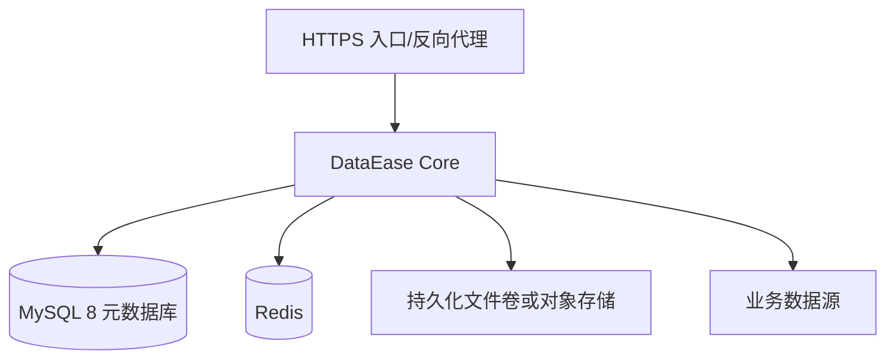

# 部署与环境架构

首期采用单实例 DataEase Core + 外部 MySQL 8 + Redis + HTTPS 反向代理。生产数据卷包括配置、日志、导出、上传和扩展驱动；按租户路径/对象键规划存储。MySQL、Redis 和存储定期备份，恢复演练覆盖元数据库与文件的一致性。

环境分层：开发环境使用 [基础服务 Compose](../../deploy/dev/compose.yaml)，应用在宿主机或独立容器启动；测试与预生产使用隔离数据库和独立密钥；生产使用外部 Secret 管理、备份和监控。配置优先级、变量表见 [配置规范](../development/configuration.md)。

部署门禁：构建制品版本和源码提交可追溯，启动迁移前有备份，健康检查和冒烟用例通过，回滚验证已完成。数据库迁移若不可逆，回滚采用备份恢复和兼容窗口，不能简单回滚镜像。
