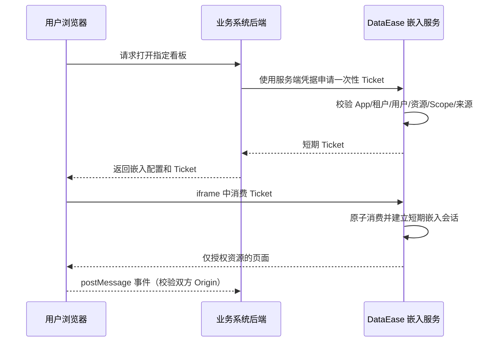

# 嵌入架构

## 首期范围

提供看板、单图表的 iframe 嵌入以及薄 JS SDK。每个接入系统在指定租户下创建 `EmbedApp`，配置 Origin 白名单、资源清单、能力 Scope、到期时间和可轮换的密钥。设计器与完整模块嵌入留待后续阶段。

App Secret 只在服务端保存和使用，存储时加密；浏览器只获得一次性 Ticket。Ticket 绑定 `tenant_id`、`app_id`、`external_subject`、`resource_type/id`、`scope`、`aud`、`jti` 和短期有效期。消费必须原子化，支持撤销和密钥轮换。外部参数只可用于已声明的筛选变量，不可直接成为 SQL 条件或授权范围。

浏览器侧采用 CSP `frame-ancestors` 限制嵌入来源，`postMessage` 双向精确校验 Origin 和消息版本。SDK 暴露 `mount`、`updateFilters`、`refresh`、`destroy` 和加载/错误/点击/高度事件；协议需要版本号，事件不携带未授权明细数据。不依赖第三方 Cookie 作为唯一认证手段。

嵌入资源请求重新执行租户、资源和数据权限；导出、跳转、联动均不得超出 Ticket Scope。所有换票、拒绝和敏感操作进入审计。
