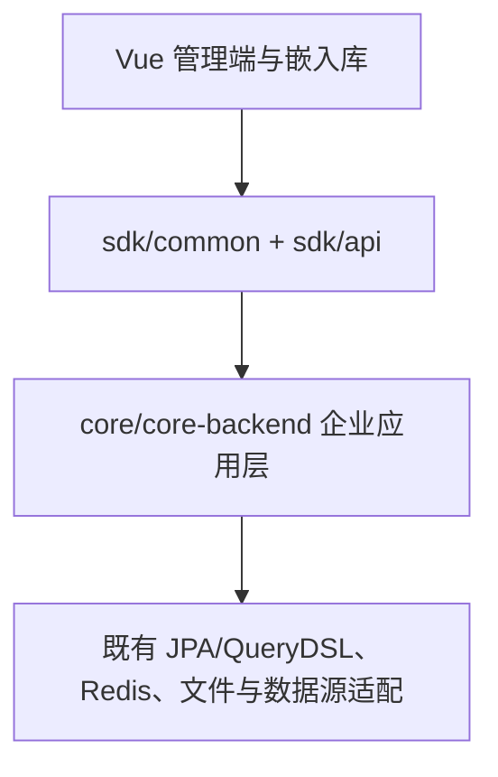

# 模块边界与目录方案

## 现有构建结构

根 `pom.xml` 只聚合 `sdk`；`sdk/api` 目前聚合 `api-base`、`api-permissions`、`api-sync`；`core/pom.xml` 聚合前后端。`core/core-backend` 已依赖 `api-base` 和 `api-permissions`。企业版子模块 `de-xpack` 是未开源实现，不纳入自研构建。

## 首期建议的落点

```text
sdk/api/api-enterprise/                 新增公开的企业功能 API、DTO 和权限动作契约
core/core-backend/src/main/java/io/dataease/enterprise/
  tenant/                               租户生命周期与上下文
  iam/                                  成员、角色、OIDC 身份映射
  permission/                           资源与数据策略
  embedding/                            App、Ticket、会话
  audit/                                审计事件与查询
  quota/                                租户配额与限流
core/core-frontend/src/
  api/enterprise/                       新增接口封装
  views/enterprise/                     管理界面
  store/modules/                        扩展现有 Pinia 租户状态
```

这个落点是源码结构审计后的设计建议，尚未创建代码目录和修改 POM。第一个 POC 先验证 `api-enterprise` 可被核心正常聚合、打包，并检查与现有 `api-permissions` 契约的关系；若需要避免重复 DTO，则直接扩展既有 API 模块并记录 ADR 变更。

## 依赖规则



- SDK 中不引用 Core 实现类。实体类不作为跨模块公共契约；DTO 要有明确版本与序列化形式。
- `tenant` 只提供上下文和所有权服务；`iam` 处理身份；`permission` 处理授权。嵌入和 API Key 使用两者的服务接口，不直接读取对方 Repository。
- 查询链路继续调用 `ChartDataManage`、`PermissionManage` 和 Provider；企业策略通过明确扩展入口进入，避免复制整套图表查询。
- 面向官方 Core 的每个补丁登记于 [补丁清单](../development/upstream.md)；上游升级时优先消除补丁。
- 前端只在现有 HTTP 客户端、Pinia、动态路由、i18n 和 `lib` 构建约束内扩展。

## 关键契约草案

| 服务 | 输入 | 输出/失败 |
| --- | --- | --- |
| `TenantResolver` | 已验证会话、API Key 或 Embed Ticket | 唯一有效的租户上下文；歧义则拒绝 |
| `TenantOwnershipService` | 租户、资源类型、资源 ID | 所有权判断；未知资源按无权处理 |
| `AuthorizationService` | 主体、租户、资源、动作 | 允许/拒绝与策略版本 |
| `DataPolicyService` | 主体、数据集、查询场景 | 行 AST、列禁用/脱敏规则 |
| `EmbedTicketService` | App、外部主体、资源、Scope | 一次性短期 Ticket；原子消费 |
| `AuditPublisher` | 事件类型、主体、资源、结果 | 不阻塞主流程的可靠审计记录；高风险操作失败策略需评审 |

接口名字只是设计契约，实际 Java 类型将在 POC 中按现有项目风格确定。
