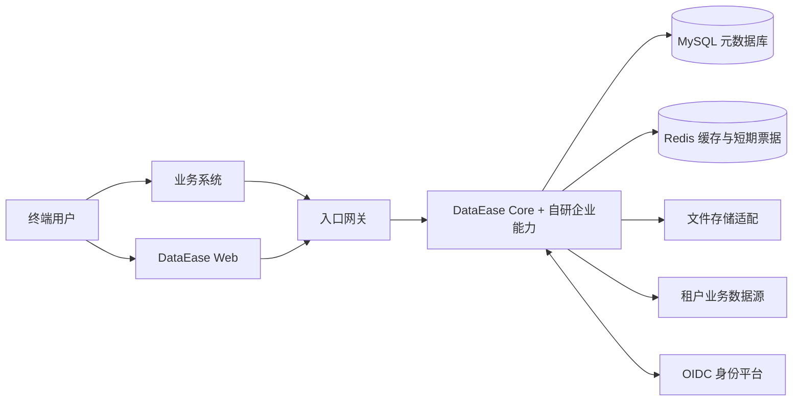

# 总体架构

## 目标与范围

第一阶段覆盖租户、用户组织角色、资源与基础行列权限、本地登录与 OIDC、看板/单图表嵌入、API Key、审计和配额。以 DataEase V3 社区版为主体，沿用 Spring Boot 3、JPA/QueryDSL、Vue 3、现有 SDK/API 和图表查询链路。暂不引入微服务拆分。

## 系统上下文

## 模块边界

| 层 | 已有位置 | 二开职责 |
| --- | --- | --- |
| 公开契约 | `sdk/api`、`sdk/common` | 新的租户/权限契约、共享上下文；保持已有 API 兼容 |
| 应用与查询 | `core/core-backend` | 调用编排、租户约束、策略执行、审计和配额 |
| 前端 | `core/core-frontend` | 租户管理、身份与权限管理、嵌入入口 |
| 基础设施 | `installer`、`Dockerfile` | 环境配置、部署、健康检查和升级 |
| 企业自研实现 | 待 POC 确认后建立独立包/模块 | tenant、iam、permission、embedding、audit、quota |

新增 Maven 模块的具体位置必须在构建基线通过后验证依赖方向。`sdk` 不依赖 `core`，企业实现不得复制 `de-xpack`。跨模块调用通过明确的服务接口；分析数据查询继续走现有 Provider/Calcite/JDBC 链路。

## 一次看板访问的数据流

1. 网关完成 TLS 和基础限流；应用后端确认本地会话或嵌入票据。
2. 身份层解析用户和当前租户，验证租户、用户、应用状态，并建立只读请求上下文。
3. 后端先判资源权限，再加载该租户所属的看板、图表和数据集。
4. 查询编排层应用行、列策略，选择租户允许的数据源，执行带超时与配额的查询。
5. 缓存键带租户、用户/权限版本、资源与筛选条件；返回前执行列脱敏和导出能力判断。
6. 访问和拒绝事件进入审计；请求结束清理 ThreadLocal。异步任务显式复制并校验上下文。

现有图表关键入口：`ChartDataApi` → `ChartDataServer` → `ChartDataManage` → `PermissionManage` → Provider。当前 `PermissionManage` 的行列权限 API 可选注入；必须在 POC 中消除“能力缺失即放行”的路径。

## 企业启动与契约校验

[ADR-015](../adr/015-schema-validation-and-startup.md)补充启动设计：历史版本迁移、当前结构验证、JPA映射及业务请求就绪各自承担职责。只有迁移、结构验证和受控初始化成功后企业请求才可进入；就绪探针不能代替后端实际拒绝。版本分离、JPA自动DDL隔离和请求门禁尚待W03实现，不把当前监听端口当作企业就绪。

本轮已修复默认值精确比较、索引逐字段校验及CHECK字面量保护，证据见[整改记录](../development/schema-validation-review.md)。后续安全设计均列出信息保留/允许规范化的属性表及独立拒绝证据；不由测试数量推断权限、编辑或嵌入完整实现。

## 交付环境

首期生产目标为 Linux x86_64、MySQL 8、Redis、Docker Compose；外部 HTTPS 入口和密钥管理由部署环境提供。本地开发模板只启动基础服务，见 [部署架构](deployment.md)。多节点、对象存储和独立租户实例预留接口，首期不作为已交付能力。

## 企业JPA结构所有权进展

2026-10-08按[ADR-015](../adr/015-schema-validation-and-startup.md)实现公开扩展过滤与映射启动检查，具体能力、真实Boot/MySQL证据及限制统一见[实施记录](../development/enterprise-jpa-isolation.md)。过滤与精确结构验证分别负责禁止自动DDL和验收正式目标，不替代权限或请求就绪。历史版本/当前目标分离及企业请求门禁仍在对应后续单元实施。
