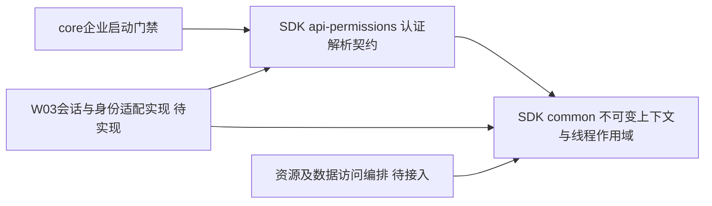

# 企业安全基础的架构细化

2026-10-07，W02/T01。本文仅维护本轮共享类型、装配与生命周期的边界；不是完整权限架构或已交付多租户认证的声明。

## 依赖方向和可信来源

SDK不依赖core实现。公共[解析契约](../../sdk/api/api-permissions/src/main/java/io/dataease/api/permissions/enterprise/AccessContextResolver.java)由认证适配器验证会话、集团/成员/身份及当前版本后返回[不可变事实](../../sdk/common/src/main/java/io/dataease/enterprise/context/AccessContext.java)；浏览器参数不能直接形成可信上下文。正数检查只证明字段形状，不能证明真实用户、成员或授权。普通用户需具备有效集团成员资格；平台管理员通过专属资格逐集团访问，不能要求其加入每个集团，也不能将普通管理员视为平台管理员。平台控制面的身份另行验证，不用虚构租户编号绕过上下文要求。

仅tenantId/userId/accessEpoch/identityEpoch不足以表达完整授权。资源归属、成员/学校状态、学校角色配对、操作、应用与会话上限必须从各自权威事实求值；嵌入和异步任务显式携带必要描述并在执行/交付复查。不能由admin标志、已捕获上下文或旧版本字段推导可访问数据。

## 装配和生命周期的拒绝边界

[启动门禁](../../core/core-backend/src/main/java/io/dataease/enterprise/bootstrap/EnterpriseAssemblyGuard.java)在普通Bean初始化前核对唯一的LoginApi、ResourceAuthApi、RowPermissionsApi、ColumnPermissionsApi及AccessContextResolver，禁止社区替补共存。类型存在不证明实现语义，也不证明旧查询和权限调用已接入；装配检查与请求/授权验证分别留证。未知FactoryBean类型不通过初始化去猜测能力。

[线程作用域](../../sdk/common/src/main/java/io/dataease/enterprise/context/AccessContextHolder.java)仅显式绑定，禁止重入换集团；所属线程关闭，异常清理；不自动传播到异步线程。当前没有生产解析器、全局请求过滤器或新HTTP路由；W03必须把真实身份解析、生命周期及旧身份分支一同实现和验证，不能仅安装本基础类就开启企业服务。

架构自评已完成。共享契约与安全边界按项目规范需要另一位评审者检查拒绝路径；用户已指定由自己或团队完成人工独立评审，结果另记，未自动合入开发分支。评审重点：启动顺序、可选/替补回退、类型假阳性、作用域清理与跨线程误用、嵌入上限缺失以及未接入旧调用链的限制。

源码/配置/实测分别见[启动门禁](../development/enterprise-bootstrap.md)、[上下文基础](../development/enterprise-context.md)及[隔离检查工具](../../tools/phase1/README.md)。新增目录与服务仅为获授权测试区；没有修改既有库/服务，没有复制XPack实现。
