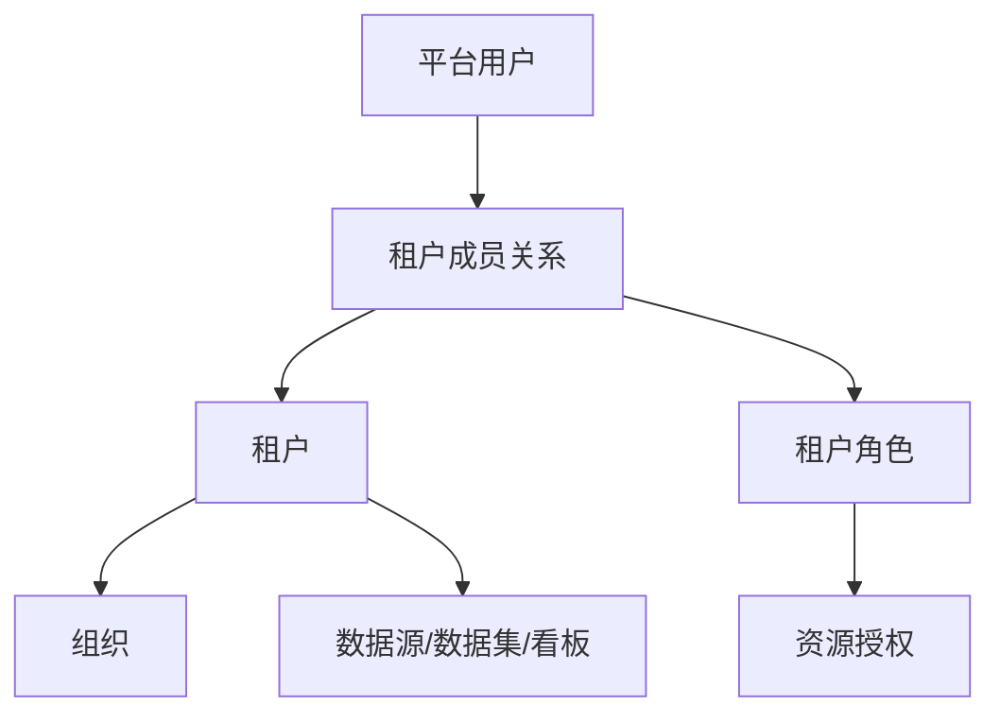

# 多租户架构

## 安全边界

`tenant_id` 表示平台安全边界；组织仅在租户内表达团队或工作空间。用户为平台身份，`tenant_member` 表示用户在某租户的资格。一名用户可属于多个租户，但一次请求只能有一个已确认的当前租户。平台管理员可以管理租户生命周期，默认没有读取租户业务数据的权限。

## 上下文建立

- 普通会话从服务端会话和成员关系解析当前租户；客户端的 `tenant_id` 只作为切换意图，不能直接授权。
- 嵌入会话从已验证的 App、Ticket、目标资源和外部用户映射导出租户。
- API Key 绑定租户和 Scope；平台级接口使用专门身份，不能伪装普通租户上下文。
- 缺失、冲突、已停用或过期的租户上下文拒绝请求。
- 异步、Quartz、导出任务需要持久化 `tenant_id`、发起用户和权限快照/版本；执行时重新校验租户状态。

## 隔离层

1. **元数据**：所有租户资源表带 `tenant_id`；读取、写入、唯一约束、分页统计和搜索均按租户约束。JPA Repository 的自动过滤只做辅助防线，原生 SQL、批量更新、关联查询另有显式审查。
2. **业务数据源**：每租户独立连接为默认方案；共享业务库时必须在数据集策略中限定租户字段。数据源凭据不能被跨租户复用。
3. **缓存与票据**：命名空间至少包含租户；含数据权限的结果还包含用户或策略版本，权限变化时失效。现有 JCache 与 Redis 行为不同，启用 Redis 前需覆盖两种实现的回归。
4. **文件与任务**：上传、导出、图片、模板、对象存储键、队列消息和 Quartz JobData 均携带租户。下载时再次鉴权。
5. **运行资源**：查询并发、导出、上传与存储配额由服务端执行。

## 初步表清单（待 POC 前逐表确认）

| 类别 | 已发现的表/实体示例 | 处置方向 |
| --- | --- | --- |
| 核心资源 | `core_datasource`、`core_dataset_group`、`core_dataset_table`、`core_chart_view`、`data_visualization_info` | 租户所有权与联合索引 |
| 权限映射 | `per_busi_resource`；用户/角色/组织表位于未开源实现范围 | 自研成员与授权表，核对兼容契约 |
| 访问衍生物 | `xpack_share`、`core_share_ticket`、`core_export_task`、`core_export_download_task`、`core_store` | 绑定租户并核对下载/访问链路 |
| 公共/系统候选 | `core_menu`、`de_standalone_version`、`QRTZ_*`、地图和字典 | 全局白名单；JobData 仍要携带租户 |
| 混合或待判定 | `core_sys_setting`、模板、字体、地图自定义区域、任务日志 | 按实际作用域逐项审计 |

目前只是源码实体初筛，不能把表名清单视为完成隔离。POC 前需输出每张表的所有权、读写入口、历史数据回填规则与例外依据。存量单租户数据先归入显式“默认租户”，备份后分批回填；任何无法判定归属的数据停止迁移并人工处理。

## 验收

使用租户 A/B 的同名资源和不同用户，覆盖按 ID 查询、搜索、复制、导入、分享、导出、缓存、下载、异步任务和删除。跨租户访问必须拒绝且不泄漏资源存在性；测试在并发与线程池复用下重复执行。
