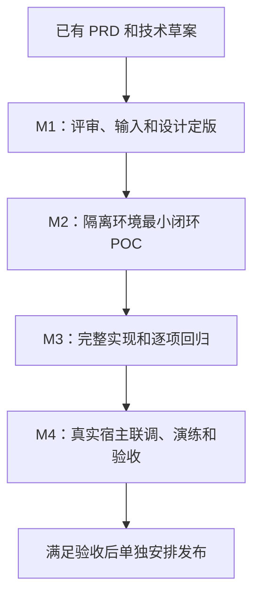

# 基于 PRD 的首期工作步骤

| 项目 | 内容 |
| --- | --- |
| 计划版本 | v1.2，2026-10-07；ADR-014分库、通用配置及现有环境保护 |
| 业务基线 | [PRD v1.2](../requirements/prd.md)、[R01–R13](../requirements/phase1.md)、[权限矩阵](../requirements/permission-matrix.md) |
| 技术输入 | [技术设计v0.4](../technical/README.md)、[DDD提案ADR-012](../adr/012-ddd-boundaries.md)、[MySQL设计](../technical/mysql8-design.md) |
| 当前进度 | W01设计/选型已推进；W02隔离环境、安全基础、社区登录及测试门禁已交付；W03实施设计准备启动。真实身份/请求链和业务权限未完成，W01/W02及P01不标全量通过 |
| 本次交付 | 工作步骤和文档入口同步；不执行代码开发、安装、数据库迁移、部署或发布 |

本文件用于确定“接下来先做什么、交付什么、何时可以继续”。技术入口、补丁候选、POC细节沿用[实施验证方案](../technical/implementation-validation.md)。以下责任为岗位建议，实际人员待安排；W01的已完成文档/待输入范围见[评审记录](w01-review.md)，其他开发/运行任务待执行，不承诺未经估算的日历工期。

## 1. 总体推进顺序

各文档主出处和同步规则见[总入口](../README.md)，R→设计→W/T/P→A/V完整关系见[追溯表](traceability.md)。本文件维护工作包依赖，不另行定义POC编号或验收预期。实际编码阶段、工程细节定版、skills及本地/Git/远程测试循环见[实施开发计划](development-plan.md)，沿用本文的依赖与验收编号。

| PRD 阶段 | 当前状态 | 主要成果 | 继续条件 |
| --- | --- | --- | --- |
| M0 需求基线 | 文档已形成，业务边界已确认 | PRD、矩阵、ADR-009/010/011、A01–A33 | 仅需求确认，不代表实现完成 |
| M1 技术设计 | v0.4设计与MySQL字典v1.1已形成，W01部分推进 | 评审/选型记录、接口/迁移/页面方案、实际环境待输入 | 数据库和账号边界、学校字段、身份契约、安全门禁和测试入口可执行 |
| M2 最小闭环 POC | W02基础部分已实现与实测，W03设计准备启动；完整P01–P06仍待 | P01–P06 实证、失败项及设计修订、验证后工作量估算 | 成对权限、集团独立源、学校过滤、嵌入编辑和撤权有证据 |
| M3 拆分与实现 | 待执行 | 完整接口、页面、迁移、旧入口适配与回归 | 首期 P0 功能齐备，所有已开放入口安全检查一致 |
| M4 联调与验收 | 待执行 | 真实宿主记录、A01–A33/V01–V10 覆盖、性能及恢复演练 | 首期允许/拒绝结果符合 PRD，限制明确，未处置越权缺陷为零 |

M2 会编写最小验证代码；验证通过后可整理为 M3 的正式实现，不能跳过代码审查、事务/兼容性和回归。POC 失败回到对应设计修订，不靠默认放行让流程继续。

## 2. 第一步：完成技术评审和输入登记（W01）

对应 M1 / T00。建议责任：技术负责人牵头，产品、后端、前端、数据、宿主及测试负责人参与。

进度见[W01记录](w01-review.md)和[ADR-013](../adr/013-mysql8-single-node.md)：MySQL8、首期应用单节点、源码后端已确认，集团独立业务数据库/账号方向已选。35张安全表完整字典及3张业务参考表已编写；开发测试服务器已提供并完成SSH预检，真实业务表/宿主账号及双集团独立数据库仍待对接/准备，不能把参考模型当真实输入。

后续输入更新：开发测试服务器及专用双集团合成数据库/账号已落实，见[W02环境记录](w02-environment.md)和[安全基线](w02-security-baseline.md)；真实业务表/宿主账号仍待对接，W01/W02未全量完成。旧“只有预检、实现未开始”的状态由本次进度替代，原阶段目标及验收边界保持。

1. 按 D01–D08 逐项确定接受范围、未决项、负责人及验证门槛；ADR-012 的上下文、聚合、旧入口适配和一致性方案仍需评审。
2. 按ADR-014执行集团分库/专用只读账号，可同MySQL实例；核验实际目标库、账号范围、完整查询及备份边界。保留测试服务器现有库/目录/服务，另行设计专用新增测试区；独立服务器/卷不是首期门槛。
3. 核对数据集、学校编号与完整源/字段依赖，选定首批真实方言和查询类型；BusinessDataset 默认映射 `CoreDatasetGroup` 的实际 dataset 节点，底层表是依赖。
4. 固化身份来源、管理登录供给、稳定 subject/namespace、App/Origin、一次性票据和会话契约，保留 React 宿主与 Vue iframe。
5. 确定类型化数据策略、看板操作和管理能力的接口及存储选择；确认旧编码不能自动扩展为导出/授权管理。
6. 列出查询、列表、预览、筛选、导出、下钻、编辑、分享、API、缓存、文件及任务的所有实际入口，逐项标记统一检查位置；核心补丁仅登记候选，实际修改后再登记补丁。
7. 绘制学校/成员/任职/权限矩阵/预览/App/副本页面流程，选代表性混合看板，确定受限编辑命令与旧画布保存的适配边界。

交付物：Markdown 技术评审记录、补充 ADR、接入/数据样本清单、接口与迁移定版范围、入口覆盖表。只有接受的具体提案变更状态；不把整份技术草案一次性标为已验证。

| 必需输入 | 提供方 | 最小内容 | 缺失时的处理 |
| --- | --- | --- | --- |
| 业务存储与集团边界 | 数据/基础设施 | MySQL8/集团分库及专用账号方向已选；还需实际双集团数据库、访问范围、网络与恢复边界的受控引用 | 不开放未验证源；领域算法/页面草图继续 |
| 学校与业务数据集 | 数据负责人 | 已给参考模型；真实学校编号列、归属、财务/教学表及统计口径对接时核对 | 合成模型可准备POC，不宣称实际业务源已接入 |
| 首批宿主 | 宿主负责人 | 后端按源码Java/SpringBoot设计；还需实际React仓库、已登录账号固定编号与网址/目标看板 | 不要求用户选择JWT/Session；合成宿主可验协议，真实联调待输入 |
| 看板与操作样本 | 产品/看板负责人 | 混合看板、学校副本、主要图表、目标导出格式及浏览器 | 验证已有样本，遗漏的首期操作仍待验收 |
| 运行与测试条件 | 开发/测试 | 隔离元数据库/业务库/缓存/文件环境、测试运行器、合成账号 | 未明确隔离环境前不启动可能自动迁移的应用 |
| 规模与团队 | 项目负责人 | 集团/学校/用户数、并发、数据及导出量、人员 | 可确定依赖顺序；日历排期和容量承诺保持待定 |

业务规则已经明确，不重新选择“学校角色是否配对”或“是否全量迁移 React”。输入不足只阻断依赖该输入的工作。

## 3. 第二步：建立可验证的开发与 POC 基线（W02）

对应 M2 / T01 / P01。前置：W01 接受对应技术范围，并明确隔离环境。建议责任：后端、测试及基础设施。

- 核对当前源码、已安装依赖、POM/Profile、前端入口及测试运行方式；保留工作区已有修改，不切换或覆盖他人改动。
- 准备 G-A/G-B 独立业务存储，各集团内 A1/A2、B1/B2 共用业务表，使用可人工核算的合成数据及账号；学校编号全局唯一。
- 验证自研命名空间和公开 SDK 的装配，优先复用现有模块；仅在必要时增加公开契约模块，不复制 XPack。
- 验证认证生命周期、集团上下文、缺失上下文拒绝、社区替补/可选权限服务不能默认放行，并在请求/任务结束清理上下文。
- 明确真实执行测试的入口并保留报告；普通 `mvn test` 成功或编译成功不能代替实际执行。详细构建约束沿 [AGENTS.md](../../AGENTS.md)。

交付物：可复现的隔离环境说明、合成夹具说明、装配/认证 POC 记录、测试执行记录。通过标准：双集团环境真实分离，缺必需安全实现拒绝/阻止启动，测试确实运行。

## 4. 第三步：实现集团、学校与身份基础（W03）

对应 T02；M2 实现验证所需最小能力，M3 补齐完整管理路径。前置：W02。建议责任：后端为主。

1. 建立集团、学校/部门、全局用户、集团成员、组织成员及外部身份映射；集团与组织保持不同概念。
2. 建立本集团成员有效性和资源集团归属；现有未判定所有权资源默认拒绝，不按目录/原生 orgId 自动推断集团。
3. 建立受控平台逐集团读取与安全切换；全读资格不自动授予编辑、导出、下钻，不向普通 App 暴露平台资格。
4. 衔接管理端多用户认证，提供成员状态、身份绑定和集团管理基础接口；停用影响后续会话和任务。
5. 按[迁移方案](../technical/data-model.md)在隔离环境实施新增迁移和验证，覆盖空库、存量及失败重试；业务库拆分单独规划。

交付物：身份/集团/组织 API、所有权校验、受控迁移及回归、平台切换证据。验收：A01–A04、A10、A23、A31；普通主体 G-A→G-B 和 G-B→G-A 均拒绝。

## 5. 第四步：实现成对任职、授权计算和撤权基础（W04）

对应 T03 / P02。前置：W03。建议责任：后端、测试。

1. 实现 permission 域 RoleAssignment，完整保存“成员＋角色＋学校范围”；角色、成员和学校必须同集团有效。
2. 实现 DataAccessPolicy、ResourceActionPolicy 和管理能力，分别校验动作及范围；ALLOW 合并、DENY 优先、未设置拒绝。
3. 实现纯规则决策及来源，角色逐任职与学校范围求交后合并；预览与真实请求使用同一算法。
4. 实现批量授权原子保存、版本冲突、当前修订读取及安全变更/epoch 同事务；W09 再覆盖真实导出/交付竞态，但基础撤权不能后补。
5. 实现成员/学校/角色/App 状态与权限复查的统一契约；旧 MANAGE/READ/导出编码经适配，不隐式扩大权限。

交付物：任职/策略/预览 API、规则测试、同版本事实与协调机制、允许/拒绝结果。验收：A05–A11、A29 相关基础路径及 V01/V04/V05/V08。

最小结果必须同时证明：A1 校长看到 A1 全业务；A1 财务只见 A1 财务；U 兼任 A1 校长/A2 财务不会取得 A2 教学；个人禁止 A2 财务导出覆盖对应允许。

## 6. 第五步：接入集团独立源和学校过滤（W05）

对应 T04 / P03。前置：W03/W04，以及已确认的数据源与学校字段。建议责任：后端、数据、测试。

- 实现集团数据源和实际存储绑定、学校字段验证及版本；源配置、导入覆盖和凭据变更等旧路径也使验证失效。
- 加载真实 BusinessDataset/图表完整依赖，拒绝目录或物理表 ID 冒充权限资源；全部源必须同集团。
- 将不可覆盖的学校条件通过 SQLMeta/AST 在源端聚合、排序、分页前施加，浏览器筛选只能缩小范围。
- 贯通图表、预览、筛选选项、下钻及编辑器取数；按已选方言验证 SQL/联表/UNION/CTE/跨源及抽取落地类型。未证明安全的类型不开放。
- 衔接池生命周期、缓存键和权限修订检查；未知/空学校、错绑源和权限服务失败不能成为全量查询。

交付物：源/学校绑定接口及记录、查询适配、真实源审计与人工核算结果、开放类型和未覆盖清单。验收：A12–A14、A17、A28、A30、A33 相关路径及 V02/V03/V06。

通过后再用实际吞吐/连接等待等结果评价改动范围；仅更换连接池键或 SQL 中出现学校条件不构成完整隔离证据。

## 7. 第六步：实现模板、学校副本与受限编辑（W06）

对应 T05 / P04。前置：W04/W05。建议责任：后端、Vue 前端、测试。

1. 复用既有画布、图表、草稿/主表及发布能力，明确服务端 DashboardModel、当前主体 Projection 和 ChangeSet。
2. 模板实例化生成学校独立看板、可变图表和快照，记录来源版本；失败全部回滚，模板更新不覆盖副本。
3. 只返回有权图表配置；无权部分统一占位，不返回数据集字段、SQL、真实敏感配置或可越权访问的引用。
4. 白名单命令在完整服务端模型应用，保存/发布/重开复查权限及依赖；旧画布、图表保存及导入覆盖路径也执行门禁。
5. 验证撤销/重做、复制/组合/布局、数据集替换、calcData/renderChart 和学校副本互不影响。

交付物：模板/副本 API、受限投影及保存适配、Vue 编辑闭环和完整版本证据。验收：A15、A18–A21、V07/V10；无权内容不泄漏、不因投影缺失被删除，越权保存整批拒绝。

## 8. 第七步：完成 React 宿主免登录嵌入（W07）

对应 T06 / P05。查看模式前置 W03–W05；编辑模式还需 W06。建议责任：后端、Vue 前端、宿主 React/后端、测试。

- 实现 App/Origin/资源动作上限、凭据轮换、引导握手、一次性 Ticket 和受限 Session；三个生命周期分别管理。
- 宿主后端根据已验证登录态取得稳定 subject，二开平台验证映射及权限；浏览器提供的 user/roles/schools 不作为事实。
- iframe 消费票据，原子一次使用，并在消费/后续请求复查用户×应用×资源交集；适配现有认证/HMAC/分享/代理身份分支。
- React 接入组件在宿主仓库实现 iframe 生命周期、筛选/刷新、加载/错误状态、精确 Origin/source 和容器实例校验；保持 DataEase Vue。
- 覆盖无第三方 Cookie、多容器、路由切换、退出/卸载、会话失效、票据重放、身份伪造和 App 缩权，编辑流程实际保存重开。

交付物：嵌入服务、Vue 入口、宿主 React 接入组件与后端对接、协议/兼容记录。宿主仓库未提供时使用合成接入端验证协议，真实 React 联调保持未完成。验收：A22–A27、A32、V09。

W03–W07 的最小实现须共同完成 M2，且 W09 中 P06 撤销/交付验证须前置执行；通过 P01–P06 后重新估算、整理 M3 正式任务并补齐全入口，不能仅凭查看成功通过 POC。

## 9. 第八步：补齐可配置的管理页面（W08）

对应 T07。前置：各页面对应 API 稳定且鉴权已验证。建议责任：Vue 前端、后端、产品、测试。

按 PRD 页面顺序实现：集团切换 → 学校组织 → 成员与外部身份 → 角色任职 → 学校×业务数据集矩阵 → 看板操作 → 最终来源预览 → 模板副本 → 嵌入应用。

矩阵分页不隐式删除其他页规则；未设置/允许/禁止分开，管理能力不混在业务数据集单元格。主体切换避免串用未保存勾选，版本冲突重新加载并提示。应用凭据仅一次展示，学校/资源范围只列本集团可管理对象。复用现有 Axios、Pinia、动态路由、UI 和 i18n，不新增另一套前端框架。

交付物：可配置页面、接口/页面联调及业务操作记录。验收：A10/A11/A18/A25 和对应允许/拒绝路径。页面设计及受控 Mock 可在 API 定版后先做；完整验收仍需后端实际求值，不靠隐藏按钮证明鉴权。

## 10. 第九步：完成导出、任务、下载和全链路撤权（W09）

对应 T08 / P06。数据导出依赖 W05，受限渲染依赖 W06，嵌入发起依赖 W07；M2 先跑最小撤销闭环，M3 覆盖所有实际开放格式。建议责任：后端、前端、测试。

1. 逐开放格式校验 VIEW∩EXPORT；资源图片/PDF、图表数据和明细导出都按当前权限，混合看板不含无权内容。
2. 异步任务显式保存集团、主体、资源、App/Session 上限及版本引用；执行、后续取数、交付、下载重新求值，后台不借管理员取数。
3. 文件有集团/主体归属和受控下载端点，不能通过永久直链绕过撤权；任务失败/撤销结果不可交付。
4. 验证预热缓存、排队/运行中任务、重试、线程/池复用及变更提交与交付并发。源停用和配置变更同样失效。
5. 验证缓存删除/取消通知延迟或失败不延长旧权限；分块下载停止后续块，记录已经发送字节无法收回的边界。

交付物：实际导出覆盖表、任务/文件安全实现、并发撤权记录、失败恢复与清理说明。验收：A08/A09、A16、A28–A31、V04–V06/V08/V10。导出、编辑及下钻均属首期 P0，不因开发顺序后移而从首期删去。

## 11. 第十步：完成迁移演练、真实联调和首期验收（W10）

对应 T09/T10 / M4。前置：M3 完整功能与回归通过。建议责任：测试牵头，产品、开发、宿主、数据及基础设施共同参与。

- 汇总 R01–R13 → 实际接口/页面/任务 → A01–A33 的追溯，执行 V01–V10；未执行、失败、未提供均单独记录。
- 在隔离/预生产环境验证空库、存量、失败重试、字段显式清空、备份恢复及兼容。业务存储若需拆分，另立可核算的数据迁移任务和回滚方案，不让启动迁移自动搬生产业务数据。
- 对首个真实集团宿主完成真实身份、角色、学校数据、目标浏览器、筛选、导出、下钻、编辑和撤销验收；保留双集团负向测试。
- 测量代表性并发、查询 p95、连接预算、学校集合、导出量及取消耗时，按真实业务规模形成阈值。单节点提案按已接受范围验证，多节点未经证明不能作为试点运行方案。
- 形成受控配置/Secret 引用、运行监控、故障处理、停用及恢复说明。回滚不能恢复社区默认放行作为企业运行状态。

交付物：Markdown 需求覆盖表、POC/联调/验收报告、性能容量结论、迁移/恢复演练记录、试点运行与回滚文档。具体发布操作在验收后单独安排，本次工作步骤不触发部署或远端推送。

完成标准：首期 P0 全部实证；跨集团访问、学校角色交叉扩权、无权图表泄漏、旧接口绕过及撤权后继续交付均为零；已有覆盖限制不能掩盖 P0 未完成。业务验收文档只有实际执行后才更新状态。

## 12. 依赖、责任和需求追溯

| 工作包 | 现有任务 | 主要需求 | 前置依赖 | 建议主责 |
| --- | --- | --- | --- | --- |
| W01 评审及输入 | T00 | R01–R13，尤其 R12 | 已有 PRD/技术草案 | 技术负责人 |
| W02 隔离及装配 | T01 | R01/R07/R12 | W01 对应范围及环境输入 | 后端/测试 |
| W03 集团身份 | T02 | R01/R02/R03/R05/R07/R11 | W02 | 后端 |
| W04 授权基础 | T03 | R03/R04/R05/R06/R08 | W03 | 后端/测试 |
| W05 源与查询 | T04 | R01/R06/R07/R08 | W03/W04、数据输入 | 后端/数据 |
| W06 模板编辑 | T05 | R08/R09/R10 | W04/W05 | 后端/Vue 前端 |
| W07 嵌入 | T06 | R08/R11/R13 | W03–W05；编辑需 W06 | 后端/宿主团队 |
| W08 管理页面 | T07 | R02–R06/R08/R10/R11 | 对应稳定 API | Vue 前端 |
| W09 导出撤权 | T08 | R01/R04/R08/R09/R11 | W05；渲染需 W06；嵌入需 W07 | 后端/测试 |
| W10 联调演练 | T09/T10 | R01–R13 | 完整 M3 及全部输入 | 测试/产品 |

迁移设计和回归随 W03 起逐包执行，W10 是全量演练，不是首次检查迁移。双集团拒绝测试随每个资源接口执行，撤权测试随权限及任务开发执行，不统一拖到最后。

允许的团队并行工作：W01 后页面草图和受控 Mock；W05 后 W06 编辑闭环与 W07 查看嵌入；接口稳定后 W08 对应页面；W05 后数据导出路径。编辑嵌入、受限图片/PDF 与全链路撤权仍须等待对应依赖。该表用于团队安排，本次不自动分派代理或创建外部任务。

## 13. 任务交付和排期方法

每个正式开发任务记录：工作包/需求编号、实际入口、允许和拒绝行为、依赖、负责人、修改范围、迁移影响、回归用例、已运行结果及未覆盖项。新增核心修改同步[上游补丁登记](../development/upstream.md)，沿[开发规范](../development/standards.md)与[测试规范](../development/testing.md)，不夹带原有修改。

用户补充交付要求：开发完成并通过对应验证后，提交本次源码/迁移/测试/Markdown并推送项目origin，具体目标与保护规则见[W02 Git交付记录](w02-environment.md)。宿主源码暂缺，合成POC可推进；真实宿主联调仍待输入。此授权针对后续开发成果，不让纯文档/预检自动触发当前提交或部署。

所有需求、设计、评审、运行和验收说明继续使用 Markdown。功能实现阶段必要的源代码、迁移和配置产物按仓库规则创建；它们不等于允许修改生产环境，本次不生成这些产物。

排期在 W01 输入和 M2 POC 证据齐备后形成：逐包区分自研新增、核心适配、数据迁移、宿主配合、测试/演练工作量；列出人员可用时间、关键依赖和失败风险，提供区间估算再确认日历。当前可以确定步骤，不能仅按文档页数估算开发天数。

**当前W01已完成选型和数据库文档部分**：利用v0.4、MySQL完整字典v1.1及评审记录继续补专用测试环境与合成业务/模拟宿主输入，形成W02隔离装配任务；参考模型可用于合成POC准备，真实对接和运行验证待执行。

### W04剩余步骤的当前实施入口（2026-10-09）

第5步统一决策、来源预览及受控空画布VIEW，第6步基础撤权及组织依赖保护，第7步累计回归／统一交付／独立验收按[W04工作包](w04-authorization.md)推进；状态与runId以[连续实施](../development/w04-remaining-execution.md)和最终回执为准。历史状态保留，不据此提前推进W05或宣称W05—W09能力已完成。

## 2026-10-09连续实施更新

以上早期状态保留为历史。当前顺序以[W05—W10连续清单](w05-w10-continuous.md)为准：W04新基线已核验，W08基础管理页面正在整包/页面验收；源绑定和查询进入[W05细化工作包](w05-business-query.md)，尚未编码。W09相关撤权随W05—W07同步验证，其他W08页面随对应接口补齐，最终W10只凭实际证据验收。各包结果与未覆盖由其开发记录及交付后新报告决定，不能按本表的先后关系推断功能通过。

### W04剩余步骤的当前实施入口（2026-10-09）

第5步统一决策、来源预览及受控空画布VIEW，第6步基础撤权及组织依赖保护，第7步累计回归／统一交付／独立验收按[W04工作包](w04-authorization.md)推进；状态与runId以[连续实施](../development/w04-remaining-execution.md)和最终回执为准。历史状态保留，不据此提前推进W05或宣称W05—W09能力已完成。
